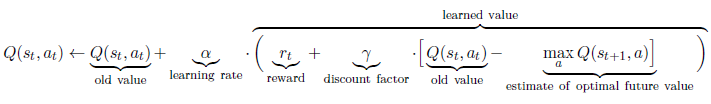

# Reinforcement Learning: Learning How to count cards at Blackjack

## Introduction

In this project I use RL to make an agent learn the optimal blackjack strategy to play.
The optimal action to play is given by the Bellman equation

In a second time it is demonstrated that the agent can learn to leverage a [simple card counting strategy](https://www.blackjack.org/blackjack-strategies/hi-lo-count/#:~:text=The%20Hi%2DLo%20Count%20strategy,(cards%202%2D6).)
 to improve its games and beat the casino.

## Instructions

Run the script Environment.R to launch the game.
